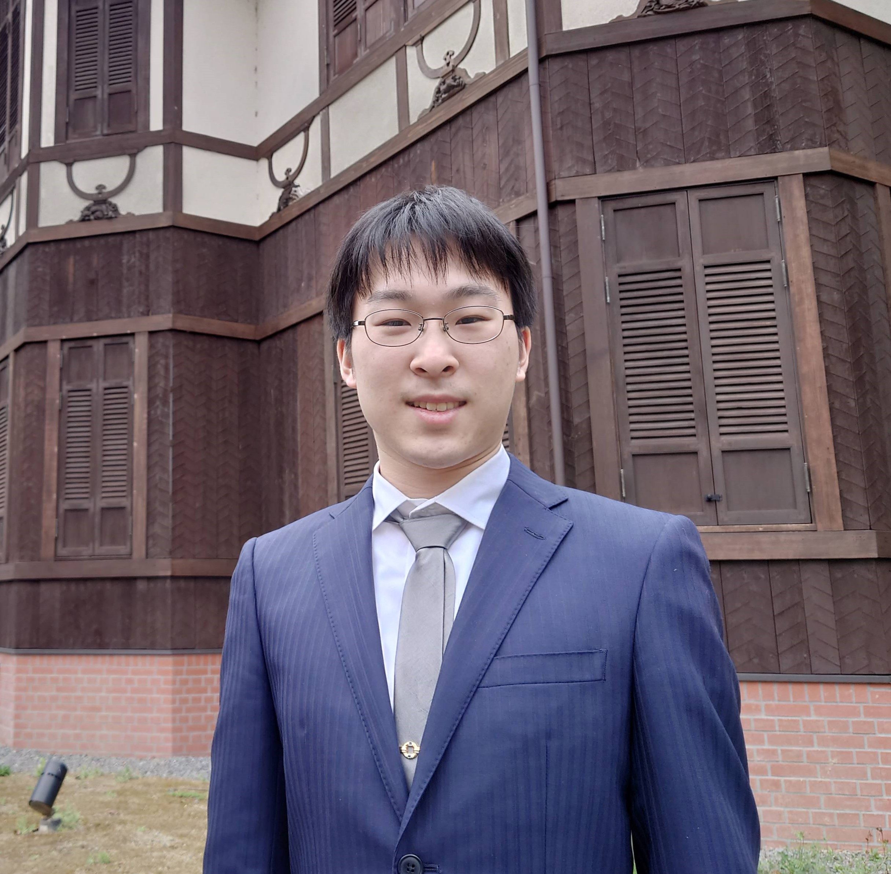

+++
title = "自己紹介"
template = "index.html"
+++

## 磯谷 彰宏
## Isotani Akihiro

IT技術者です。会社での肩書はDevOps Engineerで、運用/テストの自動化や品質管理や障害対応などしています。社内用の品質保証ツール開発のためにRustやGoを書くこともあります。

I'm an IT Engineer. DevOps, SRE.

最近は外部環境に迅速に対応するために法務や監査をコードに落とし込む取り組みについて関心を持っています。

金融、ゲーム理論、サイバーセキュリティ、安全保障に興味があります。

I’m interested in Finance, Game Theory, and Cyber Security

乗馬と読書が趣味です。ビジネスプランコンテストを見に行くことがあります。

一種外務員試験に合格しています。

[意見・主張ログ](/opinions/)

[Cloudflare判決は何を武器化したのか――インフラ幇助責任・認知の自由・情報安全保障――](/opinions/2025/2025-12-infra-responsibility-cognitive-warfare/)

## 略歴

- 洛南高等学校 2018年3月卒業
- 京都工芸繊維大学 情報工学課程 2023年3月卒業

## Publication

- システムからの通知に「人間味のある言葉」は必要か? 2023年06月30日 — [ASCII × FIXER cloud.config Tech Blog](https://ascii.jp/elem/000/004/142/4142747/)
(注:退職済み)

## 連絡先,SNSなど

- Email hi[a/t]iak[dot]jp
- [LinkedIn](https://www.linkedin.com/in/akihiro-isotani-436771209)
- [Facebook](https://www.facebook.com/akihiro.isotani)
- [Instagram](https://instagram.com/akinyate)
- [GitHub](https://github.com/akis0)

